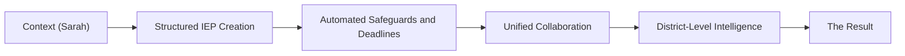

# System Overview User Story: How TeachTracker Works in Practice

**Project:** IEP Manager Lead Intelligence  
**Note:** The Proof section is the System Overview only. The demo video is removed. Remove the `VideoPlayer` component and do not include any video module on the landing page. The full System Overview lives on a dedicated deep-dive page (separate route); the main landing page should only show a slim teaser and a clear link/CTA into this page.

---

## User Story

**As a** school district decision-maker (Special Ed Director, Case Manager, or Administrator)  
**I want** to understand how TeachTracker works in practice for someone like me  
**So that** I can evaluate whether it fits our district's needs before booking a demo.

---

## Flow Pattern: How TeachTracker Works in Practice (Slide-Based Page)

The section must be presented as a **sequential flow** on the landing page (visible sequence, clear progression), not as unrelated blocks.

**Stages in order:**

1. **Context (Sarah)** — Persona and current pain points
2. **Structured IEP Creation** — Dynamic structure, validation, compliance during creation
3. **Automated Safeguards & Deadlines** — Monitoring, alerts, dashboard compliance health
4. **Unified Collaboration** — Teachers and parents, single source of truth
5. **District-Level Intelligence** — Aggregated data, risk indicators, reports
6. **The Result** — Outcomes for Sarah, admins, parents, compliance

### Presentation Requirements (Scroll-Native, Mobile-First)

- The UI must present this content as a **flow** (visible sequence and progression), not separate blocks.
- The System Overview should be implemented as a **slide-like deep-dive page** (one stage per “slide” on desktop), separate from the primary landing page.
- On desktop, users should move through stages with a clear stepper or next/previous controls (slide progression).
- On mobile, the experience must remain **scroll-native** (slides stack vertically while preserving order).
- Each stage must have a **short summary** plus optional **details**.
- On mobile, details should be **collapsed by default** (accordion pattern).
- Users must be able to **jump to a stage** from a stage strip (horizontal chips or similar).
- The current stage should be **visually indicated** during scroll or slide progression.
- The global header (logo + nav) must always allow users to return to the main landing page from any route.
- From the deep-dive page, clicking **Features**, **Testimonials**, or **Get a Demo** should navigate to the main landing page and land on the corresponding section.
- The Hero section on the main landing page must not include extra \"How it works\" or \"Learn more\" buttons that duplicate the dedicated \"See the full walkthrough\" CTA in the teaser section.

### Acceptance Criteria

- No demo video exists on the landing page.
- The `VideoPlayer` component is removed and unused.
- The System Overview is the primary Proof section.
- The System Overview deep-dive resides on its own page/route; the main landing page only shows a concise teaser plus a link/CTA to that page.
- The logo in the global header links to the main landing page (`/`) from any route.
- Header links for Features, Testimonials, and Book Demo always work from any page (they can trigger a full-page navigation back to `/` anchors).
- Mobile UX: stage summaries are readable without fatigue.
- Mobile UX: stage details expand only when requested.
- Each stage has a **1–2 sentence summary** that stands alone.
- Long lists live in **collapsible details** (accordion behavior on mobile).

---

## Flow content: How TeachTracker Works in Practice (Slides)

### Slide 1: Context (Sarah)

**Summary:** Sarah manages 28 students across two campuses. She needs one place to run IEP work.

<strong>Details</strong>

Sarah’s responsibilities include:

- Drafting and updating IEPs
- Scheduling annual and triennial meetings
- Tracking service minutes
- Communicating with parents
- Preparing documentation for audits

Before TeachTracker, her workflow lived across spreadsheets, shared drives, email threads, and calendar reminders.

- Deadlines required constant manual tracking.
- Service documentation required cross-checking.
- Audit preparation meant late nights.

---

### Slide 2: Structured IEP Creation

**Summary:** TeachTracker structures the IEP as she types. It flags gaps before they become risk.

<strong>Details</strong>

When Sarah creates a new IEP inside TeachTracker:

- Required fields adapt based on student eligibility.
- Validation flags missing or inconsistent entries in real time.
- State-aligned compliance checks run automatically.

Instead of guessing, she sees a live compliance status indicator.

---

### Slide 3: Automated Safeguards & Deadlines

**Summary:** Deadlines are monitored in the background. Sarah gets proactive alerts, not surprises.

<strong>Details</strong>

TeachTracker continuously monitors:

- Annual review dates
- Evaluation timelines
- Service delivery requirements
- Meeting scheduling windows

Sarah and her administrator receive alerts long before deadlines approach.

District leaders see a dashboard-level compliance health score across campuses.

---

### Slide 4: Unified Collaboration

**Summary:** Teachers and parents work from one source of truth. Communication stays aligned.

<strong>Details</strong>

General education teachers log in to:

- Review accommodations
- Acknowledge implementation
- Track service minutes

Parents access a simplified portal that provides:

- Clear visibility into goals
- Meeting summaries
- Progress updates

Everyone works from the same source of truth.

---

### Slide 5: District-Level Intelligence

**Summary:** Leaders see risk early across campuses. Audit prep becomes a dashboard view, not a scramble.

<strong>Details</strong>

Administrators don’t wait for audits to discover gaps.

TeachTracker aggregates data across schools to provide:

- Compliance status by campus
- Service delivery trends
- Upcoming risk indicators
- Documentation completeness reports

What used to require weeks of manual preparation becomes available in seconds.

---

### Slide 6: The Result

**Summary:** Paperwork drops. Oversight improves. Transparency increases. Compliance becomes proactive.

<strong>Details</strong>

- Sarah spends less time managing paperwork.
- Administrators gain real-time oversight.
- Parents gain transparency.
- Compliance becomes proactive instead of reactive.

TeachTracker isn't just a digital IEP form.

It's the operational infrastructure for special education.

